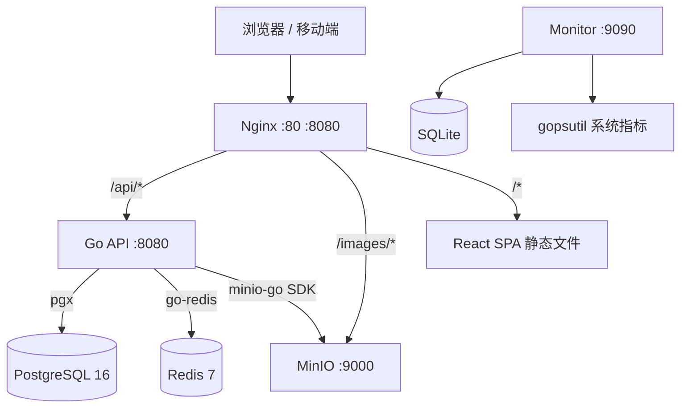
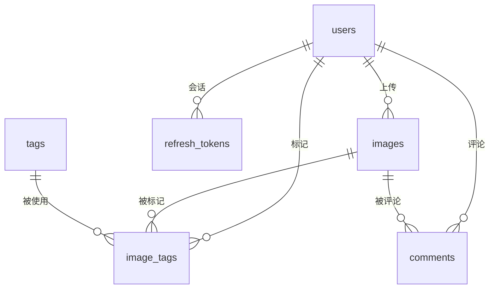

# 架构设计

## 系统架构



## 服务说明

| 服务 | 端口 | 职责 |
|---|---|---|
| Nginx | 80 / 8080 | 反向代理、静态文件、限流、gzip |
| Go API | 8080 | 认证、图片 CRUD、标签、评论、管理 |
| PostgreSQL 16 | 5432 | 用户/图片/标签/令牌元数据 |
| Redis 7 | 6379 | 令牌桶限流 |
| MinIO | 9000 + 9001 | 图片文件存储、缩略图 |
| MinIO-init | — | 一次性初始化 bucket 和匿名访问策略 |
| Monitor | 9090 | CPU/内存/磁盘采集，独立于主平台 |

## 数据流

### 上传流程

```
用户选择文件 → Nginx (200MB限制) → Go API
  → 校验 MIME (magic bytes)
  → 检查存储配额
  → 生成缩略图 (300px, Lanczos, JPEG 80%)
  → 上传原图 + 缩略图到 MinIO
  → 写入 images 表
  → 关联标签 → image_tags 表
  → 返回上传结果
```

### 浏览流程

```
用户访问图库 → Nginx → React SPA
  → GET /public/images?page=1&limit=20
  → Go API → PostgreSQL (分页 + 标签 JOIN)
  → fillURLs() 填充图片 URL（CDN_BASE_URL 拼接或预签名 URL）
  → JSON 响应
  → 浏览器直接请求 /images/{storageKey} → Nginx → MinIO
```

图片文件不经过 Go API 服务器，Nginx 直接代理到 MinIO。Go API 只处理元数据和认证。

### 认证流程

```
登录 → Access Token (JWT, 15min) + Refresh Token (SHA-256 hash 存 DB, 7d)
     ↓
每次请求 → Authorization: Bearer <Access Token>
     ↓ 过期
客户端拦截器 → POST /auth/refresh → 新 Access Token + 新 Refresh Token (旧 Refresh 吊销)
     ↓ 都过期
跳转登录页
```

## 数据库设计

### ER 关系



### 表结构要点

**users** — 用户与认证
- `password_hash` bcrypt cost=12，永不出现在 API 响应中
- `role` 枚举 `user` / `admin`，admin 存储配额无上限
- `storage_used` 每次上传时原子递增（`UPDATE users SET storage_used = storage_used + $1`）

**images** — 图片元数据
- `storage_key` S3 对象键，格式 `{userID}/{sanitizedName}_{unixNano}{ext}`
- `deleted_at` 软删除标记。实际上删除操作调用的是硬删除（同步清 DB + MinIO）
- `is_public` 默认 true，所有上传公开可见

**tags** — 标签字典
- `name` UNIQUE，重复创建时 upsert
- 全局共享标签池，所有用户的标签汇集在一起

**image_tags** — 多对多关联
- 复合主键 `(image_id, tag_id, user_id)`，同一用户不能对同一图片重复标记同一标签
- 切换标签（点赞模式）：先 DELETE，检查 `RowsAffected()`，为 0 则 INSERT

**refresh_tokens** — 令牌管理
- `token_hash` SHA-256，原始 token 只返回给客户端一次
- `revoked` 布尔标记，注销或刷新时置 true

**comments** — 评论
- 复合索引 `(image_id, created_at)` 优化按图片查询
- 删除权限：作者本人 或 admin

## 关键决策

### 1. 为什么用 pgx 而不是 GORM？

- **类型安全**：编译期检查 SQL 结果映射
- **零反射**：没有 GORM 的运行时反射开销
- **SQL 显式**：直接写 SQL，复杂查询不会生成低效语句
- **连接池**：pgxpool 内置连接池管理

代价：没有自动迁移和关联预加载，表创建和 JOIN 都要手写。

### 2. 为什么 Access Token 只有 15 分钟？

即使 Access Token 泄露，攻击窗口只有 15 分钟。Refresh Token 存储在数据库中（SHA-256 哈希），可随时吊销。每次刷新时轮换 Refresh Token，旧的立即失效。

### 3. 为什么共享标签池？

标签作为可浏览的分类体系，跨用户共享有意义。用户 A 标记「风景」和用户 B 标记「风景」汇集在同一标签下，按标签浏览时能看到所有人的相关图片。

代价：恶意用户可以标记不相关的标签。目前没有标签审核机制，由管理员手动管理。

### 4. 为什么图片文件不经过 Go API？

Nginx 直接代理 MinIO，Go API 只返回 URL。这样做：
- Go 进程不消耗内存传输文件
- Nginx 的 `sendfile` 系统调用零拷贝传输
- MinIO 支持 Range 请求（视频 seek、断点续传）

### 5. 为什么没有用软删除？

虽然 `images` 表有 `deleted_at` 字段，但实际删除操作直接硬删（DELETE FROM + Remove MinIO objects）。理由：
- 这个平台的图片大多是公开分享，不需要「回收站」功能
- 软删除会增加查询复杂度（每个查询都要 `WHERE deleted_at IS NULL`）
- 如果将来需要，`deleted_at` 字段已就位，改 `Delete` 方法即可

### 6. 为什么监控平台独立部署？

监控平台（monitor/）与主平台完全解耦：
- 独立端口 9090
- 独立二进制
- 独立数据库（SQLite）
- 独立 systemd 服务

理由：
- 主平台挂了监控不受影响，可以看到故障时刻的系统状态
- 不需要在 Go API 引入 gopsutil 依赖
- 可以单独启停、升级

## 限流策略

| 端点 | 限制 | 实现方式 |
|---|---|---|
| 注册 | 3 次/分钟 | Redis 令牌桶 |
| 登录 | 10 次/分钟 | Redis 令牌桶 |
| 上传 | 30 次/分钟 | Redis 令牌桶 |
| 通用 API | 30 次/秒 | Nginx `limit_req` |

Redis 不可用时限流降级为放行，不影响正常使用。

## 安全措施

- **密码**：bcrypt cost=12，不可逆
- **JWT**：HMAC-SHA256，短时效 + 轮换刷新
- **上传校验**：MIME 白名单 + magic bytes 检测 + 文件名清洗（替换 `\ / : * ? " < > |`）
- **安全头**：`X-Content-Type-Options: nosniff`、`X-Frame-Options: DENY`、Referrer-Policy
- **密钥不提交**：`.env.example` 用占位符
- **请求体限制**：Nginx `client_max_body_size 200m` + Go `MaxMultipartMemory 200MB`

## 已踩过的坑

1. **`io.TeeReader` 导致上传 0 字节** — 改为 `io.ReadAll` 一次性读入内存
2. **MinIO 预签名 URL 返回内网地址** — `fillURLs()` 改用 `CDN_BASE_URL` 拼接
3. **Nginx `proxy_pass` 变量导致 MinIO XML 响应** — 去掉变量，固定 DNS
4. **VPS Docker build OOM (2GB 内存)** — 改用本地编译 + scp 上传二进制
5. **Android `content://` URI 上传失败** — fetch 不支持，改用 XMLHttpRequest
6. **Nginx 重启后报 "host not found upstream 'api'"** — 添加 `resolver 127.0.0.11`
7. **`image_tags` 主键冲突多用户标记同图片** — PK 改为 `(image_id, tag_id, user_id)`
